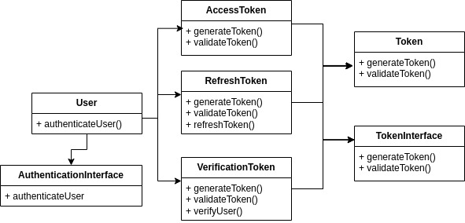
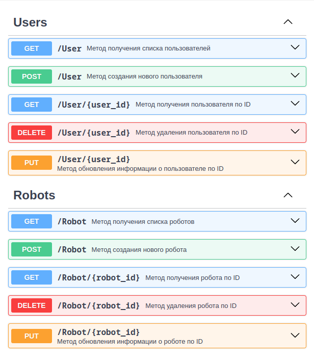
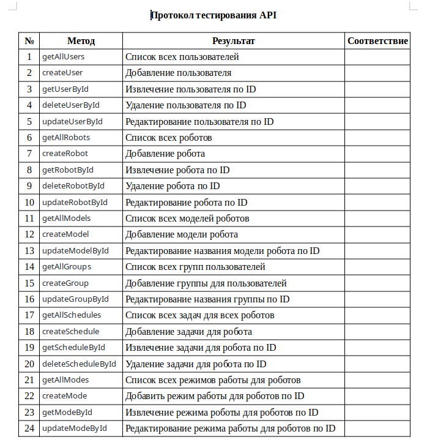

### USERCASE диаграмма

### ERD диаграмма

    robot {
        id integer pk increments
        model_id integer *> model.id
        mac_adress varchar(12)
        user_group_id integer *>* user_group.id
        user_id integer *> user.id
        status boolean
        servicing datetime
        comment text
        firmware_version varchar(250)
    }
    
    user {
        id integer pk increments
        FIO varchar(100)
        group integer *> user_group.id
        adress varchar(150)
        phone varchar(20)
        email varchar(50)
        password text
    }
    
    user_group {
        id integer pk increments
        name_group integer
    }
    
    work_schedule {
        id integer pk increments
        robot_id integer *> robot.id
        date datetime
        mode integer *> modes.id
    }
    
    modes {
        id integer pk increments
        name varchar(50)
    }
    
    model {
        id integer pk increments
        name varchar(150)
    }

### Пользовательский интерфейс

### UML авторизация пользователя по токен

### OpenAPI

    openapi: 3.0.1
    info:
      title: Робот пылесос
      version: 0.0.1
    servers:
      - url: http://localhost:8080/api/v1
    paths:
        /User:
            get:
                summary: Метод получения списка пользователей
                tags:
                    - Users
                operationId: getAllUsers
                responses:
                    "200":
                        description: Успешный ответ со списком пользователей
                        content:
                            application/json:
                                schema:
                                    $ref: "#/components/schemas/Users"
                    "default":
                        description: Всё остальное
                        content:
                            application/json:
                                schema:
                                    $ref: "#/components/schemas/Error"
            post:
                summary: Метод создания нового пользователя
                tags:
                    - Users
                operationId: createUser
                requestBody:
                    required: true
                    content:
                        application/json:
                            schema:
                                $ref: "#/components/schemas/Users"
                responses:
                    "200":
                        description: Успешный ответ добавления нового пользователя
                        content:
                            application/json:
                                schema:
                                    $ref: "#/components/schemas/Users"
        /User/{user_id}:
            get:
                summary: Метод получения пользователя по ID
                tags:
                    - Users
                operationId: getUserById
                parameters:
                    - name: user_id
                      in: path
                      required: true
                      description: ID пользователя
                      schema:
                        type: string
                responses:
                    "200":
                        description: Успешный ответ получения пользователя по ID
                        content:
                            application/json:
                                schema:
                                    $ref: "#/components/schemas/Users"
                    "400":
                        description: Ошибка при получении пользователя по ID
                        content:
                            application/json:
                                schema:
                                    $ref: "#/components/schemas/Error"
                    "default":
                        description: Всё остальное
                        content:
                            application/json:
                                schema:
                                    $ref: "#/components/schemas/Error"
            delete:
                summary: Метод удаления пользователя по ID
                tags:
                    - Users
                operationId: deleteUserById
                parameters:
                    - name: user_id
                      in: path
                      required: true
                      description: ID пользователя
                      schema:
                        type: string
                responses:
                    "200":
                        description: Успешное удаление пользователя по ID
                        content:
                            application/json: {}
                    "500":
                        description: Ошибка при удалении пользователя по ID
                        content:
                            application/json:
                                schema:
                                    $ref: "#/components/schemas/Error"
                    "default":
                        description: Всё остальное
                        content:
                            application/json:
                                schema:
                                    $ref: "#/components/schemas/Error"
            put:
                summary: Метод обновления информации о пользователе по ID
                tags:
                    - Users
                operationId: updateUserById
                parameters:
                    - name: user_id
                      in: path
                      required: true
                      description: ID пользователя
                      schema:
                        type: string
                requestBody:
                    required: true
                    content:
                        application/json:
                            schema:
                                $ref: "#/components/schemas/Users"
                responses:
                    "200":
                        description: Успешное обновление информации о пользователе
                        content:
                            application/json:
                                schema:
                                    $ref: "#/components/schemas/Users"
                    "default":
                        description: Всё остальное
                        content:
                            application/json:
                                schema:
                                    $ref: "#/components/schemas/Error"
        
        /Robot:
            get:
                summary: Метод получения списка роботов
                tags:
                    - Robots
                operationId: getAllRobots
                responses:
                    "200":
                        description: Успешный ответ со списком роботов
                        content:
                            application/json:
                                schema:
                                    $ref: "#/components/schemas/Robots"
                    "default":
                        description: Всё остальное
                        content:
                            application/json:
                                schema:
                                    $ref: "#/components/schemas/Error"
            post:
                summary: Метод создания нового робота
                tags:
                    - Robots
                operationId: createRobot
                requestBody:
                    required: true
                    content:
                        application/json:
                            schema:
                                $ref: "#/components/schemas/Robot"
                responses:
                    "200":
                        description: Успешный ответ добавления нового робота
                        content:
                            application/json:
                                schema:
                                    $ref: "#/components/schemas/Robots"
        /Robot/{robot_id}:
            get:
                summary: Метод получения робота по ID
                tags:
                    - Robots
                operationId: getRobotById
                parameters:
                    - name: robot_id
                      in: path
                      required: true
                      description: ID робота
                      schema:
                        type: string
                responses:
                    "200":
                        description: Успешный ответ получения робота по ID
                        content:
                            application/json:
                                schema:
                                    $ref: "#/components/schemas/Robots"
                    "400":
                        description: Ошибка при получении робота по ID
                        content:
                            application/json:
                                schema:
                                    $ref: "#/components/schemas/Error"
                    "default":
                        description: Всё остальное
                        content:
                            application/json:
                                schema:
                                    $ref: "#/components/schemas/Error"
            delete:
                summary: Метод удаления робота по ID
                tags:
                    - Robots
                operationId: deleteRobotById
                parameters:
                    - name: robot_id
                      in: path
                      required: true
                      description: ID робота
                      schema:
                        type: string
                responses:
                    "200":
                        description: Успешное удаление робота по ID
                        content:
                            application/json: {}
                    "500":
                        description: Ошибка при удалении робота по ID
                        content:
                            application/json:
                                schema:
                                    $ref: "#/components/schemas/Error"
                    "default":
                        description: Всё остальное
                        content:
                            application/json:
                                schema:
                                    $ref: "#/components/schemas/Error"
            put:
                summary: Метод обновления информации о роботе по ID
                tags:
                    - Robots
                operationId: updateRobotById
                parameters:
                    - name: robot_id
                      in: path
                      required: true
                      description: ID робота
                      schema:
                        type: string
                requestBody:
                    required: true
                    content:
                        application/json:
                            schema:
                                $ref: "#/components/schemas/Robots"
                responses:
                    "200":
                        description: Успешное обновление информации о роботе
                        content:
                            application/json:
                                schema:
                                    $ref: "#/components/schemas/Robots"
                    "default":
                        description: Всё остальное
                        content:
                            application/json:
                                schema:
                                    $ref: "#/components/schemas/Error"
        /Model:
            get:
                summary: Метод получения списка моделей
                tags:
                    - Models
                operationId: getAllModels
                responses:
                    "200":
                        description: Успешный ответ со списком моделей
                        content:
                            application/json:
                                schema:
                                    $ref: "#/components/schemas/Models"
                    "default":
                        description: Всё остальное
                        content:
                            application/json:
                                schema:
                                    $ref: "#/components/schemas/Error"
            post:
                summary: Метод создания новой модели
                tags:
                    - Models
                operationId: createModel
                requestBody:
                    required: true
                    content:
                        application/json:
                            schema:
                                $ref: "#/components/schemas/Models"
                responses:
                    "200":
                        description: Успешный ответ добавления новой модели
                        content:
                            application/json:
                                schema:
                                    $ref: "#/components/schemas/Models"
        /UserGroup:
            get:
                summary: Метод получения списка групп
                tags:
                    - UsersGroups
                operationId: getAllGroups
                responses:
                    "200":
                        description: Успешный ответ со списком групп
                        content:
                            application/json:
                                schema:
                                    $ref: "#/components/schemas/UsersGroups"
                    "default":
                        description: Всё остальное
                        content:
                            application/json:
                                schema:
                                    $ref: "#/components/schemas/Error"
            post:
                summary: Метод создания новой группы
                tags:
                    - UsersGroups
                operationId: createGroup
                requestBody:
                    required: true
                    content:
                        application/json:
                            schema:
                                $ref: "#/components/schemas/UsersGroups"
                responses:
                    "200":
                        description: Успешный ответ добавления новой группы
                        content:
                            application/json:
                                schema:
                                    $ref: "#/components/schemas/UsersGroups"
    components:
        schemas:
            Robot:
                type: object
                required: 
                  - robot_id
                  - model_id
                  - mac_adress
                  - user_group_id
                  - user_id
                  - status
                  - servicing
                  - comment
                  - firmware_version
                properties: 
                  robot_id:
                    type: integer
                  model_id:
                    type: integer
                    description: id модели робота
                  mac_adress:
                    type: string
                  user_group_id:
                    type: integer
                    description: id группы с доступом к обслуживанию
                  user_id:
                    type: integer
                    description: id пользователя
                  status:
                    type: boolean
                  servicing:
                    type: string
                    format: date-time
                    description: Дата и время обслуживания
                  comment:
                    type: string
                    description: комментарий к заявке на обслуживание
                  firmware_version:
                    type: string
            Model:
                type: object
                required:
                    - model_id
                    - model_name
                properties: 
                    model_id:
                        type: integer
                    models_name:
                        type: string
            User:
                type: object
                required:
                    - user_id
                    - fio
                    - group_id
                    - adress
                    - phone
                    - email
                    - password
                properties: 
                    user_id:
                        type: integer
                    fio:
                        type: string
                    group_id:
                        type: integer
                        description: id группы к которой пренадлежит пользователь
                    adress:
                        type: string
                    phone:
                        type: string
                        example: +7 (000) 000-00-00
                    email:
                        type: string
                        example: example@mail.ru
                    password: 
                        type: string
            UserGroup:
                type: object
                required:
                    - user_group_id
                    - name_group
                properties:
                    user_group_id:
                        type: integer
                    name_group:
                        type: string
                        description: Название группы
            WorkSchedule:
                type: object
                required:
                    - work_schedule_id
                    - robot_id
                    - date
                    - mode
                properties: 
                    work_schedule_id:
                        type: integer
                    id_robot:
                        type: integer
                        description: id робота
                    date:
                        type: string
                        format: date
                    mode_id:
                        type: integer
            Mode:
                type: object
                required:
                    - mode_id
                    - mode_name
                properties: 
                    mode_id:
                        type: integer
                    mode_name:
                        type: string
            Users:
                type: array
                items:
                    $ref: "#/components/schemas/User"
            Robots:
                type: array
                items:
                    $ref: "#/components/schemas/Robot"
            Models:
                type: array
                items:
                    $ref: "#/components/schemas/Model"
            UsersGroups:
                type: array
                items:
                    $ref: '#/components/schemas/UserGroup'
            Error:
                type: object
                required:
                    - codeError
                    - messageError
                properties:
                    codeError:
                        type: string
                        example: 123f456
                        description: Код ошибки
                    messageError:
                        type: string
                        example: error
                        description: Сообщение ошибки

