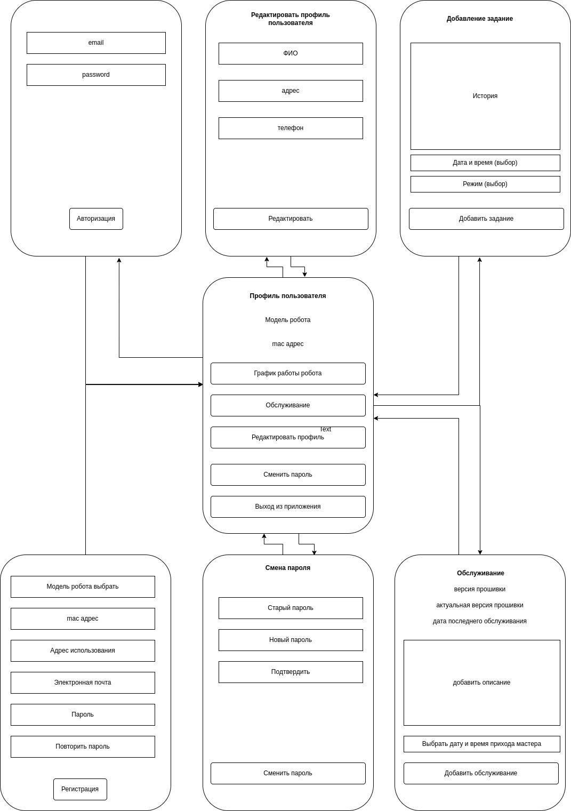

ERD диаграмма

ERD диаграмма

    robot {
        id integer pk increments
        model_id integer *> model.id
        mac_adress varchar(12)
        user_group_id integer *>* user_group.id
        user_id integer *> user.id
        status boolean
        servicing datetime
        comment text
        firmware_version varchar(250)
    }
    
    user {
        id integer pk increments
        FIO varchar(100)
        group integer *> user_group.id
        adress varchar(150)
        phone varchar(20)
        email varchar(50)
        password text
    }
    
    user_group {
        id integer pk increments
        name_group integer
    }
    
    work_schedule {
        id integer pk increments
        robot_id integer *> robot.id
        date datetime
        mode integer *> modes.id
    }
    
    modes {
        id integer pk increments
        name varchar(50)
    }
    
    model {
        id integer pk increments
        name varchar(150)
    }
пользовательский интерфейс
